# Laporan Posttest 1 - Sistem Pendataan Atlet Basket

**Nama :** Elfin Sinaga  
**NIM :** 2409106024        
**Kelas :** A24

---

## Deskripsi Program
Program ini adalah **Sistem Pendataan Atlet Basket** sederhana yang dikembangkan dengan bahasa Java untuk mengelola data atlet basket dan tim.

### Fitur CRUD:
**Data Atlet**
* **Create**: Menambahkan data pemain
* **Read**: Menampilkan data pemain
* **Update**: Mengubah Tim yang Lama menjadi Tim Baru, posisi pemain, nomor punggung, serta statistik
* **Delete**: Menghapus data pemain

**Data Atlet**
* **Create**: Menambahkan data Tim
* **Read**: Menampilkan data Tim
* **Update**: Mengubah nama Tim
* **Delete**: Menghapus data Tim

---

## Struktur Class (Nilai Tambah)
Program ini menggunakan 3 Class untuk memisahkan logika data:
1. `Main`: Program di jalankan.
2. `Atlet`: mengeloloa data Atlet.
3. `Tim`: Mengelola data Tim.

---

## Dokumentasi Tampilan Program

### Menu Utama
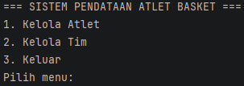

### ATLET
### Menu Atlet
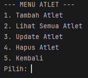
### Tambah Atlet
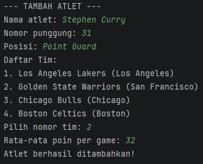
### Lihat Atlet
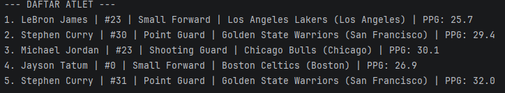
### Update Atlet
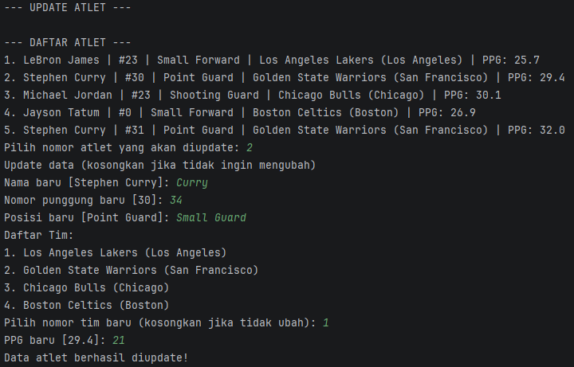
### Hapus Atlet
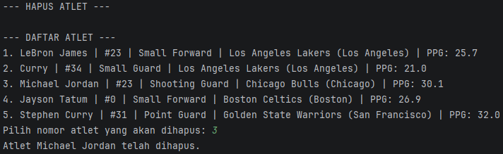

### TIM
### Menu Tim
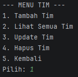
### Tambah Tim
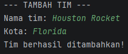
### Lihat Tim
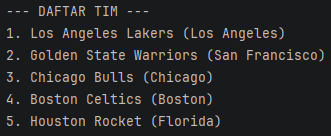
### Update Tim
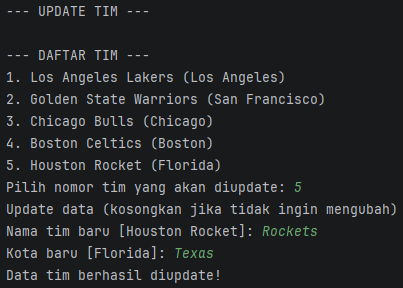
### Hapus Tim
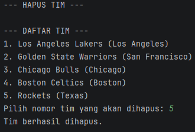